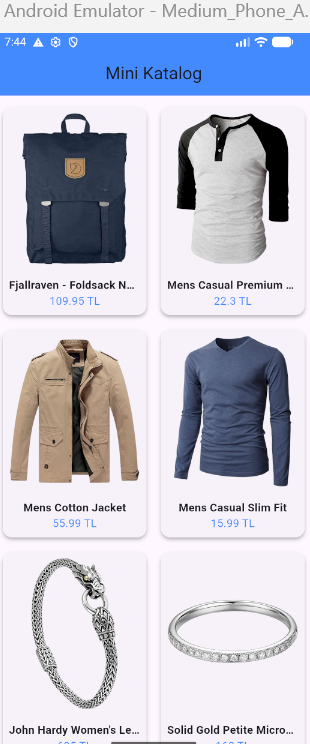
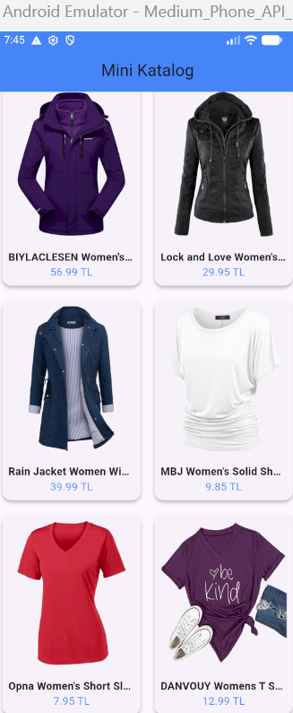
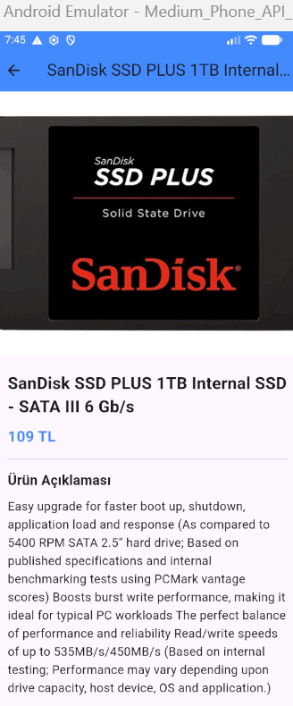
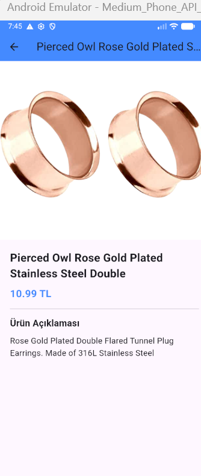
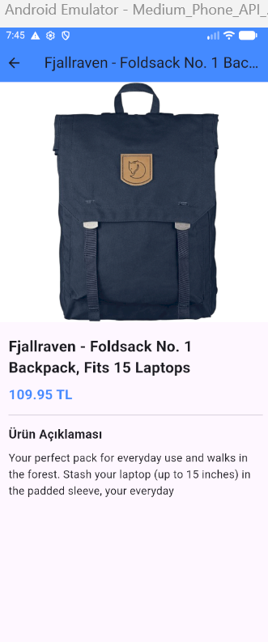

    Mini Katalog Uygulaması
    Proje Açıklaması:

    Bu uygulama, Fake Store API üzerinden canlı verileri çekerek kullanıcıya şık bir alışveriş kataloğu sunan bir Flutter projesidir. Proje kapsamında veriler asenkron olarak çekilmiş, özel bir Ürün Modeli (Model Class) yapısı kurulmuş ve Navigator kullanılarak detay sayfası geçişleri sağlanmıştır.
    --Kullanılan Teknolojiler ve Sürüm--
    Flutter Sürümü: 3.41.4
    Dil: Dart
    Paketler: http (API entegrasyonu için)

    --Ekran Görüntüleri--
    
    
      

    
    
    
    
     
     --SCREENSHOTS KLASÖRÜNDEN FOTOĞRAFLARA ULAŞABİLİRSİNİZ--

    Çalıştırma Adımları:

    Projeyi yerel bilgisayarınızda çalıştırmak için şu adımları izleyin:

    Bağımlılıkları Yükleyin: Bashflutter pub get
    
    Uygulamayı Çalıştırın: Bashflutter run
